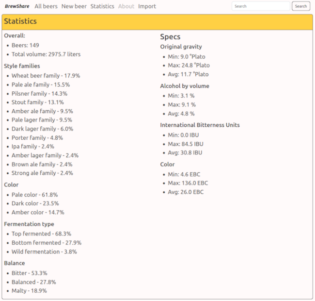

<h1 align="center">BrewShare</h1>

### About The Project
BrewShare lets you access and share your brew recipes with friends and your homebrew club via shareable links.
BrewShare was created in a dire need for quick and easy way to share beer recipe details with fellow homebrewers.

### Features
- Create quick view of beer specification and it's ingredients
- Import recipes from BeerXML file (tested on Beersmith 3.2.8)
- View statistics from all beers in database

### Built With
[![Java][Java.com]][Java-url]
[![Spring][Spring.io]][Spring-url]
[![MySQL][MySQL.com]][MySQL-url]
[![Docker][Docker.com]][Docker-url]
[![Thymeleaf][Thymeleaf.com]][Thymeleaf-url]
[![Bootstrap][Bootstrap.com]][Bootstrap-url]

## Modules:

### Beer library

### Statistics
Statistics module shows following stats:
- overall stats:
  - beer count,
  - total volume brewed,
- aggregate stats (minimum, maximum, average):
  - original gravity,
  - alcohol by volume,
  - international bitterness units,
  - color,
- stats based on BJCP (Beer Judge Certification Program) style guidelines tags shown in percentages:
  - style families,
  - color,
  - fermentation type,
  - bitterness balance.

BJCP style tags statistics module is based on BJCP 2021 style guidelines json:

https://github.com/ascholer/bjcp-styleview/blob/main/styles.json



### Imports


## Getting Started
To get a local copy up and running follow these simple example steps.

### Prerequisites
* Git
* Docker

### Running the App

Clone the repository:

  ```sh
git clone https://github.com/YoBombel/BrewShare.git
  ```

Navigate to the project directory:

  ```sh
cd BrewShare
  ```

Build and run the app using Docker Compose:

  ```sh
docker-compose up -d
  ```

The app should now be running at http://localhost:8081

### Stopping the App

You can stop the app by running the following command in the project directory:

  ```sh
docker-compose down
  ```

<!-- LICENSE -->

## License

Distributed under the GNU GPLv3  License. See `LICENSE.txt` for more information.

Project
Link: [https://github.com/YoBombel/BrewShare](https://github.com/YoBombel/BrewShare)

[contributors-shield]: https://img.shields.io/github/contributors/BienkowskiTomasz/Home-Supplies-Monitor.svg?style=for-the-badge
[contributors-url]: https://github.com/BienkowskiTomasz/Home-Supplies-Monitor/graphs/contributors
[forks-shield]: https://img.shields.io/github/forks/BienkowskiTomasz/Home-Supplies-Monitor.svg?style=for-the-badge
[forks-url]: https://github.com/BienkowskiTomasz/Home-Supplies-Monitor/network/members
[stars-shield]: https://img.shields.io/github/stars/BienkowskiTomasz/Home-Supplies-Monitor.svg?style=for-the-badge
[stars-url]: https://github.com/BienkowskiTomasz/Home-Supplies-Monitor/stargazers
[issues-shield]: https://img.shields.io/github/issues/BienkowskiTomasz/Home-Supplies-Monitor.svg?style=for-the-badge
[issues-url]: https://github.com/BienkowskiTomasz/Home-Supplies-Monitor/issues
[license-shield]: https://img.shields.io/github/license/BienkowskiTomasz/Home-Supplies-Monitor.svg?style=for-the-badge
[license-url]: https://github.com/BienkowskiTomasz/Home-Supplies-Monitor/blob/master/LICENSE.txt
[linkedin-shield]: https://img.shields.io/badge/-LinkedIn-black.svg?style=for-the-badge&logo=linkedin&colorB=555
[linkedin-url]: https://linkedin.com/in/linkedin_username
[product-screenshot]: images/screenshot.png
[Java.com]: https://img.shields.io/badge/java-007396?style=for-the-badge&logo=java&logoColor=white
[Java-url]: https://www.java.com/
[Spring.io]: https://img.shields.io/badge/spring-green?style=for-the-badge&logo=spring&logoColor=white
[Spring-url]: https://spring.io/
[MySQL.com]: https://img.shields.io/badge/MySQL-4479A1?style=for-the-badge&logo=mysql&logoColor=white
[MySQL-url]: https://www.mysql.com/
[Docker.com]: https://img.shields.io/badge/Docker-0DB7ED?style=for-the-badge&logo=docker&logoColor=white
[Docker-url]: https://www.docker.com/
[Thymeleaf.com]: https://img.shields.io/badge/Thymeleaf-40cc12?style=for-the-badge&logo=thymeleaf&logoColor=white
[Thymeleaf-url]: https://www.thymeleaf.org/
[Bootstrap.com]: https://img.shields.io/badge/Bootstrap-563D7C?style=for-the-badge&logo=bootstrap&logoColor=white
[Bootstrap-url]: https://getbootstrap.com